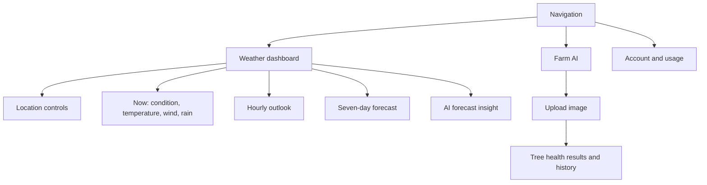

# ForecastAI Frontend Implementation Plan

## Product direction

**ForecastAI is a calm, decisive planning companion—not a data dump.** The home screen should answer three questions in seconds: where am I, what is happening now, and how will it affect the next few hours and days.

The visual system uses a weather-responsive sky, spacious cards, clear temperature hierarchy, and an accessible high-contrast night theme. The core audience is everyday users; Farm AI is a focused secondary workflow for growers.

## API contract and frontend boundary

The browser only calls the Nest proxy. `VITE_API_URL` is the optional deployment-time base URL; local development defaults to `http://localhost:3001`. Never expose the WeatherAI token in the web app.

| Experience | Proxy route | Notes |
| --- | --- | --- |
| Auto-detected forecast | `GET /v1/weather/geo?days=7&units=metric` | Default home load |
| Precise device location | `GET /v1/weather?lat=&lon=&days=7&units=metric` | Uses browser permission, then proxy |
| Coordinate fallback | `GET /v1/weather?...` | Available behind the location control |
| Account quota | `GET /v1/dashboard` / `GET /v1/usage` | Treat failed quota data as non-blocking |
| Farm image analysis | `POST /v1/trees/analyze` | Multipart upload, asynchronous-feeling progress UI |

## Information architecture



## Delivery phases

### Phase 1 — Foundation and weather dashboard (complete)

- Establish responsive weather design tokens and automatic day/night treatment.
- Replace raw-data presentation with a clear hero, hourly strip, 7-day outlook, and AI insight card.
- Support IP geolocation on load, browser location on request, coordinate fallback, loading, refresh, and recoverable errors.
- Use typed response models and a configurable API origin.

### Phase 2 — Reliable location and preferences

- Add a small location search service (requires a geocoding provider or a new backend endpoint; current API only accepts coordinates/IP).
- Persist recent locations, unit preference, and the last selected location in local storage.
- Add Celsius/Fahrenheit conversion to the UI while passing `units` to the API.
- Deep-link a selected location using `?lat=&lon=`.

### Phase 3 — Forecast depth

- Add hourly detail and chart interaction without hiding essential data behind a graph.
- Surface weather alerts only when supplied by an approved backend source.
- Show `ai_summary` only when the backend requests it; label it clearly and preserve a useful non-AI fallback.
- Add a last-updated timestamp, cache-aware refresh feedback, and retry behaviour for 429/5xx responses.

### Phase 4 — Farm AI workflow

- Build a dedicated mobile-first uploader with image requirements, region/context fields, and clear consent copy.
- Show upload/progress/error states; render confidence, canopy coverage, tree health, observations, and recommendations from the analysis response.
- Add history, filters, and a quota indicator driven by `/v1/trees/history` and `/v1/trees/quota`.

### Phase 5 — quality, accessibility, and release

- Keyboard-test location controls, ensure visible focus states, use semantic headings, and validate contrast in both themes.
- Add unit/component tests for weather-code mapping and API error states; add route-level integration tests with mocked proxy responses.
- Test mobile widths (320, 375, 768px) and desktop (1280px); monitor Lighthouse performance and accessibility.
- Add error telemetry with no precise location data, deployment environment configuration, and a concise web README.

## Component structure

```text
src/
  api/weather.ts          # typed proxy client and error normalization
  components/weather/     # WeatherHero, HourlyForecast, DailyForecast, InsightCard
  components/ui/          # Button, panel, empty/error/loading states
  hooks/useWeather.ts     # request, location, refresh, cache state
  pages/Home.tsx
  pages/Farm.tsx
  pages/Account.tsx
  types/weather.ts
```

The current implementation keeps the first dashboard compact while the UI is stabilised. Phase 2 should extract the API and components before more routes are added.

## Acceptance criteria

- A user can see a useful forecast without typing coordinates.
- A location permission failure never traps the user; IP lookup and coordinate entry remain available.
- The dashboard is readable and usable at 320px and 1280px.
- Weather loading, empty/error, and refresh states are intentional—not blank screens.
- No upstream secrets or third-party API keys are shipped to the browser.
- Farm AI and account failures do not break the primary weather experience.
