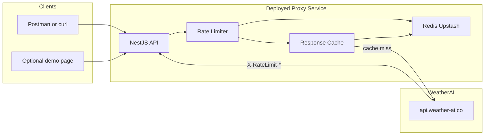
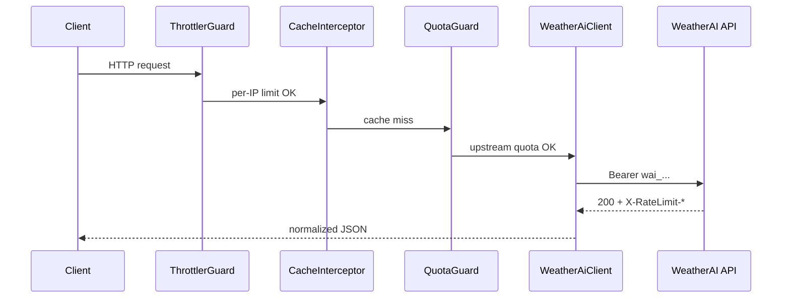
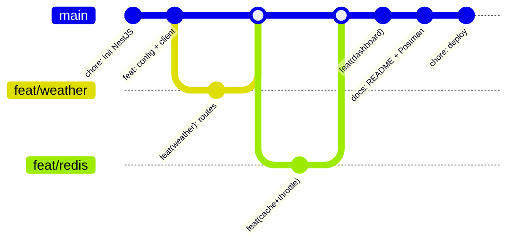
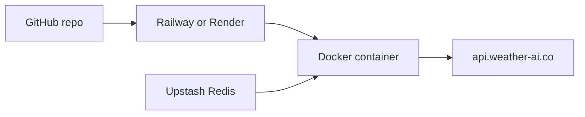

# WeatherAI Backend Server — Implementation Plan

> **Assignment:** Build a deployed backend service that integrates [WeatherAI APIs](https://weather-ai.co/docs), proxies upstream calls (API key never exposed to clients), and demonstrates clean architecture with rate limiting, caching, documentation, and proper git history.
>
> **Timeline:** 2 days · **Stack:** NestJS + TypeScript + Redis (Upstash) · **Deploy:** Railway or Render

---

## Table of Contents

1. [Goals & Scope](#goals--scope)
2. [Architecture](#architecture)
3. [Tech Stack](#tech-stack)
4. [Project Structure](#project-structure)
5. [API Surface](#api-surface)
6. [Rate Limiting & Caching](#rate-limiting--caching)
7. [Implementation Phases & Todos](#implementation-phases--todos)
8. [Git History Strategy](#git-history-strategy)
9. [Documentation Deliverables](#documentation-deliverables)
10. [Deployment Plan](#deployment-plan)
11. [Environment Variables](#environment-variables)
12. [Evaluation Mapping](#evaluation-mapping)
13. [Risks & Mitigations](#risks--mitigations)

---

## Goals & Scope

### In scope

- Deployed NestJS proxy service integrating real WeatherAI REST APIs (`https://api.weather-ai.co`)
- API key stored server-side only (`wai_*` Bearer token)
- Redis-backed per-IP rate limiting and response caching
- Upstream quota guard using `X-RateLimit-*` headers
- Simplified aggregate endpoint (`GET /v1/dashboard`)
- README, `docs/`, Swagger (`/api`), and Postman collection
- Atomic conventional commits with readable git history

### Out of scope (MVP)

- Premium full-stack Frontend Web Application (React/Vite)
- Firebase callable functions (`cancelSubscription`, `getPaystackConfig`, etc.)
- Webhooks, SMS, Pro/Scale routes (documented as future work)
- Exhaustive edge-case test coverage

### Evaluation criteria (from assignment brief)


| Criterion                   | Deliverable                                               |
| --------------------------- | --------------------------------------------------------- |
| Core functionality          | Live WeatherAI integration; proxy simplifies client calls |
| Code quality & architecture | NestJS modules, services, DI, typed DTOs                  |
| Deployment & documentation  | Live URL; README + docs + Swagger + Postman               |
| Professional signal         | Clean git history with conventional commits               |


---

## Architecture




### Request lifecycle




### Key design decisions


| Decision                      | Rationale                                                       |
| ----------------------------- | --------------------------------------------------------------- |
| NestJS over Fastify/FastAPI   | Familiarity; faster delivery in 2 days; built-in architecture   |
| Proxy layer                   | Hides API key; simplifies frontend; enables cache + rate limits |
| Redis                         | Shared state across replicas for scaling                        |
| `ai=false` default on weather | Preserves AI quota on Free plan (200 req/mo)                    |
| `/v1/dashboard` aggregate     | One client call replaces three upstream calls                   |


---

## Tech Stack


| Layer         | Choice                | Package / Tool                                       |
| ------------- | --------------------- | ---------------------------------------------------- |
| API framework | NestJS + TypeScript   | `@nestjs/core`, `@nestjs/common`                     |
| Upstream HTTP | Axios via Nest        | `@nestjs/axios`                                      |
| Rate limiting | Throttler + Redis     | `@nestjs/throttler`, `ioredis`                       |
| Caching       | Cache manager + Redis | `@nestjs/cache-manager`, `cache-manager-ioredis-yet` |
| Validation    | class-validator       | `class-validator`, `class-transformer`               |
| Config        | Config module         | `@nestjs/config` + Joi or Zod                        |
| API docs      | Swagger               | `@nestjs/swagger`                                    |
| Local Redis   | Docker                | `redis:7-alpine` in docker-compose                   |
| Prod Redis    | Upstash               | Managed Redis URL                                    |
| Deploy        | Railway or Render     | Dockerfile                                           |


---

## Project Structure

```
WeatherAi-Assignment/
├── IMPLEMENTATION_PLAN.md      # this file
├── src/
│   ├── main.ts
│   ├── app.module.ts
│   ├── config/
│   │   ├── config.module.ts
│   │   └── configuration.ts
│   ├── common/
│   │   ├── common.module.ts
│   │   ├── weather-ai.client.ts
│   │   ├── quota.guard.ts
│   │   ├── quota.service.ts
│   │   └── http-exception.filter.ts
│   ├── health/
│   │   ├── health.module.ts
│   │   └── health.controller.ts
│   ├── weather/
│   │   ├── weather.module.ts
│   │   ├── weather.controller.ts
│   │   ├── weather.service.ts
│   │   └── dto/
│   ├── account/
│   │   ├── account.module.ts
│   │   ├── account.controller.ts
│   │   └── account.service.ts
│   ├── dashboard/
│   │   ├── dashboard.module.ts
│   │   ├── dashboard.controller.ts
│   │   └── dashboard.service.ts
│   └── trees/
│       ├── trees.module.ts
│       ├── trees.controller.ts
│       └── trees.service.ts
├── docs/
│   ├── ARCHITECTURE.md
│   └── API.md
├── postman/
│   ├── WeatherAI-Proxy.postman_collection.json
│   └── WeatherAI-Proxy.postman_environment.json
├── test/                       # optional integration tests
├── .gitignore
├── .env.example
├── Dockerfile
├── docker-compose.yml
├── nest-cli.json
├── package.json
├── tsconfig.json
└── README.md
```

---

## API Surface

### Core routes (Day 1 priority)


| Proxy route           | Upstream              | Purpose                       |
| --------------------- | --------------------- | ----------------------------- |
| `GET /health`         | —                     | Deploy health check           |
| `GET /v1/weather`     | `GET /v1/weather`     | Current + forecast by lat/lon |
| `GET /v1/weather/geo` | `GET /v1/weather-geo` | Weather + IP geo-detect       |
| `GET /v1/current`     | `GET /v1/current`     | Current conditions only       |
| `GET /v1/usage`       | `GET /v1/usage`       | Quota / billing stats         |
| `GET /v1/dashboard`   | **aggregate**         | Weather + usage + trees quota |


**Weather query parameters:** `lat`, `lon`, `days`, `ai` (default `false`), `units`, `lang`

### Secondary routes (Day 2 if time)


| Proxy route              | Upstream                             |
| ------------------------ | ------------------------------------ |
| `GET /v1/daily`          | `GET /v1/daily`                      |
| `GET /v1/hourly`         | `GET /v1/hourly`                     |
| `POST /v1/trees/analyze` | `POST /v1/trees/analyze` (multipart) |
| `GET /v1/trees/history`  | `GET /v1/trees/history`              |
| `GET /v1/trees/quota`    | `GET /v1/trees/quota`                |


### Deferred (document in README as future work)

- `GET /v1/forecast14`, `GET /v1/insights`, `GET /v1/ip-lookup` (Pro+)
- Webhooks CRUD (Pro+)
- SMS routes (Scale + admin approval)
- Firebase callable functions

### Proxy error shape

```json
{
  "error": {
    "code": "RATE_LIMITED",
    "message": "Upstream quota nearly exhausted",
    "retryAfter": 3600
  }
}
```


| Code                    | HTTP | When                                 |
| ----------------------- | ---- | ------------------------------------ |
| `RATE_LIMITED`          | 429  | Per-IP or upstream quota exceeded    |
| `UPSTREAM_ERROR`        | 502  | WeatherAI 5xx or timeout             |
| `UPSTREAM_UNAUTHORIZED` | 502  | Invalid API key (logged server-side) |
| `FEATURE_NOT_AVAILABLE` | 403  | Plan-gated route on Free tier        |
| `BAD_REQUEST`           | 400  | Invalid query params                 |


---

## Rate Limiting & Caching

### Rate limiting (two layers)

1. **Per-IP sliding window** — `@nestjs/throttler`, Redis store, ~60 req/min globally
2. **Upstream quota guard** — `QuotaGuard` reads `X-RateLimit-Remaining`; short-circuit at < 5% remaining; refresh from `GET /v1/usage` every 5 min

### Caching


| Resource      | Cache key pattern                    | TTL    |
| ------------- | ------------------------------------ | ------ |
| Weather       | `weather:{lat}:{lon}:{days}:{units}` | 5 min  |
| Current       | `current:{lat}:{lon}`                | 2 min  |
| Usage         | `usage`                              | 5 min  |
| Trees quota   | `trees:quota`                        | 10 min |
| Trees history | `trees:history`                      | 2 min  |


- Cache only `200` responses
- Serve stale cache on upstream `503` (stale-while-revalidate)
- Local dev fallback: in-memory cache if Redis unavailable (document limitation)

---

## Implementation Phases & Todos

### Phase 0 — Prerequisites

- [x] **0.1** Create WeatherAI developer account at [weather-ai.co](https://weather-ai.co)
- [x] **0.2** Generate API key (`wai_...`) from Dashboard → API Keys
- [x] **0.3** Add key to local `.env` (never commit)
- [x] **0.4** Confirm Free plan; note monthly limits (1K req, 200 AI req)

---

### Phase 1 — Project scaffold & git baseline

**Branch:** `main`  
**Commits:** `chore: initialize NestJS project`, `chore: add .gitignore and .env.example`

- [x] **1.1** Run `nest new` (or manual scaffold) with TypeScript, ESLint, Prettier
- [x] **1.2** Add `.gitignore` — `.env`, `node_modules/`, `dist/`, `.DS_Store`
- [x] **1.3** Create `.env.example` with all required variables (placeholders only)
- [x] **1.4** Add `ConfigModule` with validated env schema (`WAI_API_KEY`, `WAI_PLAN`, `REDIS_URL`, `PORT`, `WAI_MOCK`)
- [x] **1.5** Configure `main.ts` — global prefix optional, CORS, validation pipe
- [x] **1.6** Initial commit to `main` *(pending — run when ready)*

**Acceptance:** `npm run build` passes; `.env` is gitignored

---

### Phase 2 — Common infrastructure

**Branch:** `feat/common` → merge to `main`  
**Commits:** `feat(config)`, `feat(common): add WeatherAi upstream HTTP client`, `feat(health)`

- [x] **2.1** Create `WeatherAiClient` service
  - Base URL: `https://api.weather-ai.co`
  - Attach `Authorization: Bearer ${WAI_API_KEY}`
  - 10s timeout; map upstream errors to proxy error shape
  - Capture and store `X-RateLimit-Limit`, `X-RateLimit-Remaining`, `X-RateLimit-Reset`
- [x] **2.2** Add `WAI_MOCK=true` mode with fixture JSON for offline dev
- [x] **2.3** Create `HttpExceptionFilter` for uniform error responses
- [x] **2.4** Create `HealthModule` — `GET /health` returns `{ status: "ok", timestamp }`
- [x] **2.5** Merge to `main`

**Acceptance:** `GET /health` returns 200; mock mode returns fixture without real API key

---

### Phase 3 — Weather & account modules

**Branch:** `feat/weather` → merge to `main`  
**Commits:** `feat(weather)`, `feat(account)`

- [x] **3.1** Create `WeatherModule` with DTOs (`WeatherQueryDto` — lat, lon, days, ai, units, lang)
- [x] **3.2** Implement `GET /v1/weather` → upstream `GET /v1/weather`
- [x] **3.3** Implement `GET /v1/weather/geo` → upstream `GET /v1/weather-geo`
- [x] **3.4** Implement `GET /v1/current` → upstream `GET /v1/current`
- [x] **3.5** Default `ai=false` unless client passes `ai=true`
- [x] **3.6** Create `AccountModule` — `GET /v1/usage` → upstream `GET /v1/usage`
- [x] **3.7** Add Swagger decorators to controllers and DTOs
- [x] **3.8** Merge to `main`

**Acceptance:** `curl "localhost:3001/v1/weather?lat=-1.2921&lon=36.8219"` returns real weather JSON

---

### Phase 4 — Redis cache & rate limiting

**Branch:** `feat/redis` → merge to `main`  
**Commits:** `feat(cache)`, `feat(throttle)`, `feat(quota)`

- [x] **4.1** Add `docker-compose.yml` with Redis service
- [x] **4.2** Configure `CacheModule` with Redis store and per-resource TTLs
- [x] **4.3** Apply cache interceptor to weather and account routes
- [x] **4.4** Configure `ThrottlerModule` with Redis storage — 60 req/min per IP
- [x] **4.5** Create `QuotaService` — track upstream remaining from response headers
- [x] **4.6** Create `SmartCacheInterceptor` — gracefully degrade (increase cache TTL) when quota drops
- [x] **4.7** Merge to `main`

**Acceptance:** Second identical weather request served from cache (verify via logs or header); 429 returned when throttled

---

### Phase 5 — Dashboard aggregate

**Branch:** `feat/dashboard` → merge to `main`  
**Commit:** `feat(dashboard): add aggregated dashboard endpoint`

- [x] **5.1** Create `DashboardModule`
- [x] **5.2** Implement `GET /v1/dashboard?lat=&lon=`
  - Parallel fetch: weather (`ai=false`), usage, trees quota
  - Normalize into single response object
  - Handle partial failures gracefully (e.g. trees quota unavailable)
- [x] **5.3** Merge to `main`

**Acceptance:** One request returns combined weather + usage + quota payload

---

### Phase 6 — Farm Intelligence (Trees module)

**Branch:** `feat/trees` → merge to `main`  
**Commit:** `feat(trees): add tree analysis and quota routes`

- [x] **6.1** Create `TreesModule` with multipart upload support
- [x] **6.2** Implement `POST /v1/trees/analyze` — forward multipart to upstream
- [x] **6.3** Implement `GET /v1/trees/history`
- [x] **6.4** Implement `GET /v1/trees/quota`
- [ ] **6.5** Merge to `main`

**Acceptance:** Image upload returns analysis JSON; history and quota endpoints work

---

### Phase 7 — Documentation

**Branch:** `docs/readme` → merge to `main`  
**Commits:** `docs: add README`, `docs: add ARCHITECTURE.md and Postman collection`, `docs: enable Swagger at /api`

- [x] **7.1** Write `README.md` (see [Documentation Deliverables](#documentation-deliverables))
  - *Note: Add an "Architecture & Highlights" section at the top of the README that explicitly maps to the assignment evaluation criteria to make grading easy.*
- [x] **7.2** Write `docs/ARCHITECTURE.md` — diagrams, module roles, request lifecycle
- [x] **7.3** Write `docs/API.md` — endpoint reference, error codes, examples
- [x] **7.4** Create Postman collection + environment (`baseUrl`, `lat`, `lon`)
- [x] **7.5** Enable Swagger UI at `/api` with full DTO documentation
- [x] **7.6** Merge to `main`

**Acceptance:** Evaluator can clone, read README, import Postman, and hit Swagger without asking questions

---

### Phase 8 — Docker & deployment

**Branch:** `chore/deploy` → merge to `main`  
**Commits:** `chore: add Dockerfile and docker-compose`, `chore: configure deployment`

- [x] **8.1** Write multi-stage `Dockerfile` (build → production image)
- [x] **8.2** Finalize `docker-compose.yml` (api + redis for local)
- [x] **8.3** Push repo to GitHub
- [ ] **8.4** Create Upstash Redis instance; copy `REDIS_URL`
- [ ] **8.5** Deploy to Railway or Render from Dockerfile
- [ ] **8.6** Set env vars: `WAI_API_KEY`, `WAI_PLAN=free`, `REDIS_URL`, `PORT`
- [ ] **8.7** Smoke test live deployment:
  - `GET /health` → 200
  - `GET /v1/weather?lat=-1.2921&lon=36.8219` → weather JSON
  - `GET /v1/dashboard?lat=-1.2921&lon=36.8219` → aggregate JSON
- [ ] **8.8** Add live URL to README
- [ ] **8.9** Final `docs` commit with deployment URL

**Acceptance:** Public HTTPS URL works; README contains live link and curl examples

---

### Phase 9 — Premium Frontend UI (React/Vite)

**Branch:** `feat/frontend` → merge to `main`  
**Commit:** `feat(frontend): build premium React/Vite web application`

- [ ] **9.1** Scaffold Vite React app (`npx create-vite@latest frontend --template react-ts`)
- [ ] **9.2** Implement Vanilla CSS design system (dark mode, glassmorphism, dynamic animations)
- [ ] **9.3** Build **Dashboard** view (Current Weather, Forecast, AI Summary, Quick Stats)
- [ ] **9.4** Build **Farm Intelligence** view (Image upload, Tree Analysis, Overlay, AI Recommendation)
- [ ] **9.5** Build **History** view (Analysis History)
- [ ] **9.6** Build **Account** view (Usage stats)
- [ ] **9.7** Connect frontend to NestJS Proxy API
- [ ] **9.8** Merge to `main`

**Acceptance:** Beautiful, dynamic UI that successfully consumes the proxy endpoints.

---

### Phase 10 — Stretch goals (only if ahead of schedule)

- [x] **10.1** `GET /v1/daily` and `GET /v1/hourly` proxy routes
- [ ] **10.2** Plan-gating middleware for Pro/Scale routes (403 with `requiredPlan`)
- [ ] **10.3** Basic e2e test with `supertest`

---

## Git History Strategy

### Branching model


| Branch    | Purpose                                         |
| --------- | ----------------------------------------------- |
| `main`    | Always deployable; production-ready code only   |
| `feat/*`  | Feature work (weather, redis, dashboard, trees) |
| `docs/*`  | Documentation-only changes                      |
| `chore/*` | Docker, CI, tooling                             |


### Conventional Commits format

```
<type>(<scope>): <short imperative summary>

[optional body]
```


| Type       | Example                                             |
| ---------- | --------------------------------------------------- |
| `feat`     | `feat(weather): add GET /v1/weather proxy route`    |
| `fix`      | `fix(cache): correct TTL key for lat/lon rounding`  |
| `docs`     | `docs: add deployment and curl examples to README`  |
| `chore`    | `chore: add Dockerfile and docker-compose`          |
| `refactor` | `refactor(common): extract QuotaService from guard` |


### Planned commit sequence

```
 1. chore: initialize NestJS project with TypeScript and ESLint
 2. chore: add .gitignore and .env.example
 3. feat(config): add validated environment configuration
 4. feat(common): add WeatherAi upstream HTTP client
 5. feat(health): add health check endpoint
 6. feat(weather): add weather and geo proxy routes
 7. feat(account): add usage proxy route
 8. feat(cache): add Redis caching with TTL per resource
 9. feat(throttle): add per-IP rate limiting via ThrottlerModule
10. feat(quota): add upstream quota guard from X-RateLimit headers
11. feat(dashboard): add aggregated dashboard endpoint
12. feat(trees): add tree analysis and quota routes          [optional]
13. docs: add README with setup, deploy, and curl examples
14. docs: add ARCHITECTURE.md and Postman collection
15. docs: enable Swagger at /api
16. chore: add Dockerfile and docker-compose for local dev
17. chore: configure deployment for Railway/Render
```

### Git hygiene rules

- Never commit `.env`, API keys, or secrets
- Commit `.env.example` with placeholders only
- No `wip` or vague commits on `main`
- Each commit must pass `npm run build`
- One logical change per commit




---

## Documentation Deliverables

### README.md (required)


| Section               | Content                                                                   |
| --------------------- | ------------------------------------------------------------------------- |
| Overview              | What the proxy does; link to [WeatherAI docs](https://weather-ai.co/docs) |
| Architecture          | Mermaid or ASCII diagram                                                  |
| Prerequisites         | Node 20+, Docker (optional), Redis                                        |
| Quick start           | `cp .env.example .env` → `docker compose up` → `npm run dev`              |
| Live URL              | Deployed base URL                                                         |
| API quick reference   | Endpoint table                                                            |
| Example requests      | curl for `/health`, `/v1/weather`, `/v1/dashboard`                        |
| Environment variables | Full table                                                                |
| Rate limiting         | Per-IP and upstream quota behavior                                        |
| Testing               | Postman import; Swagger at `/api`                                         |
| Future work           | Pro/Scale routes, webhooks, SMS                                           |


### docs/ARCHITECTURE.md

- System context diagram
- Module responsibilities
- Request lifecycle (throttle → cache → quota → upstream)
- Caching and rate-limit tables
- Deployment topology
- Design decisions

### docs/API.md

- Full endpoint reference with params and example JSON
- Proxy error codes
- Plan-gated route notes

### Postman

- `postman/WeatherAI-Proxy.postman_collection.json`
- `postman/WeatherAI-Proxy.postman_environment.json`
- Variables: `baseUrl`, `lat` (`-1.2921`), `lon` (`36.8219`)

### Swagger

- Live at `/api` via `@nestjs/swagger`
- All DTOs decorated with `@ApiProperty`

---

## Deployment Plan




### Steps

1. Push repository to GitHub
2. Create Upstash Redis database (free tier)
3. Connect Railway/Render to GitHub repo
4. Deploy using `Dockerfile`
5. Configure environment variables (see below)
6. Verify health and weather endpoints on live URL
7. Update README with live URL

### 2-day schedule


| Day       | Morning                               | Afternoon                             |
| --------- | ------------------------------------- | ------------------------------------- |
| **Day 1** | Phases 0–2 (scaffold, client, health) | Phases 3–4 (weather, account, Redis)  |
| **Day 2** | Phase 5–6 (dashboard, trees if time)  | Phases 7–8 (docs, deploy, smoke test) |


---

## Environment Variables


| Variable         | Required | Default                  | Description                          |
| ---------------- | -------- | ------------------------ | ------------------------------------ |
| `WAI_API_KEY`    | Yes*     | —                        | WeatherAI Bearer token (`wai_...`)   |
| `WAI_PLAN`       | No       | `free`                   | Plan tier: `free`, `pro`, `scale`    |
| `WAI_MOCK`       | No       | `false`                  | Use fixture data instead of real API |
| `REDIS_URL`      | No       | `redis://localhost:6379` | Redis connection string              |
| `PORT`           | No       | `3001`                   | HTTP server port                     |
| `THROTTLE_TTL`   | No       | `60000`                  | Rate limit window (ms)               |
| `THROTTLE_LIMIT` | No       | `60`                     | Max requests per window per IP       |
| `NODE_ENV`       | No       | `development`            | `development` or `production`        |


 Not required when `WAI_MOCK=true`

### `.env.example`

```bash
WAI_API_KEY=wai_your_key_here
WAI_PLAN=free
WAI_MOCK=false
REDIS_URL=redis://localhost:6379
PORT=3001
THROTTLE_TTL=60000
THROTTLE_LIMIT=60
NODE_ENV=development
```

---

## Evaluation Mapping


| Criterion                   | How this plan delivers                                         |
| --------------------------- | -------------------------------------------------------------- |
| Core functionality          | Real API integration; proxy routes; dashboard aggregate        |
| Code quality & architecture | NestJS modules/controllers/services; DI; guards; filters; DTOs |
| Deployment & documentation  | Live URL; README; docs/; Swagger; Postman                      |
| Git history                 | 15–17 atomic conventional commits telling a clear story        |


---

## Risks & Mitigations


| Risk                        | Mitigation                                                     |
| --------------------------- | -------------------------------------------------------------- |
| No API key during early dev | `WAI_MOCK=true` with fixture JSON                              |
| Free plan quota exhaustion  | Cache aggressively; default `ai=false`; document limits        |
| Redis unavailable locally   | In-memory fallback for dev; Upstash required for prod          |
| Trees multipart complexity  | Implement after core weather routes; stream upload to upstream |
| 2-day time overrun          | Prioritize Phases 1–5 and 7–8; defer trees and stretch goals   |
| Secrets in git history      | `.gitignore` from commit 1; never commit `.env`                |


---

## Progress Tracker

Use this summary to track overall completion:


| Phase | Description                 | Status        |
| ----- | --------------------------- | ------------- |
| 0     | Prerequisites               | ✅ Done        |
| 1     | Scaffold & git baseline     | ✅ Done        |
| 2     | Common infrastructure       | ✅ Done        |
| 3     | Weather & account           | ✅ Done        |
| 4     | Redis cache & rate limiting | ✅ Done        |
| 5     | Dashboard aggregate         | ✅ Done        |
| 6     | Trees module (stretch)      | ✅ Done        |
| 7     | Documentation               | ✅ Done        |
| 8     | Docker & deployment         | ⬜ Not started |
| 9     | Premium Frontend UI         | ⬜ Not started |
| 10    | Stretch goals               | ⬜ Not started |


> Update checkboxes and status columns as you complete each task. Mark phases ✅ Done when all child todos are checked.

---

*Last updated: July 13, 2026*