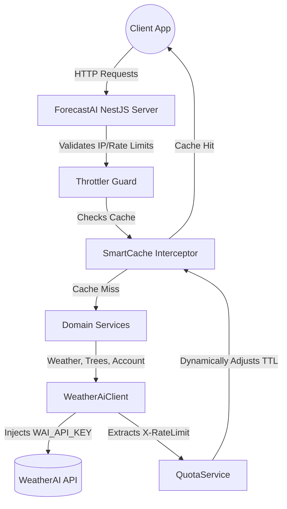

# ForecastAI: Unified Full-Stack Platform

A complete, production-ready Full-Stack application integrating with the [WeatherAI API](https://weather-ai.co/docs). It features a highly optimized NestJS backend proxy and a premium, glassmorphism-themed React (Vite) frontend—all deployed seamlessly in a single unified Docker container.

## Architecture & Monorepo Structure

This project is structured as a Monorepo to provide clean separation of concerns while maintaining a frictionless, unified deployment pipeline.

```text
forecast-ai/
  ├── server/    # NestJS Backend API Proxy (Smart Caching, Rate Limiting)
  ├── web/       # React Vite Frontend (Premium Dashboard UI)
  ├── Dockerfile # Multi-stage root build for unified deployment
  └── docker-compose.yml
```

### The "Unified Container" Deployment Strategy
Instead of paying for and managing two separate servers (one for the frontend, one for the backend), this project uses a powerful **Multi-Stage Docker Build**. 
1. The `Dockerfile` compiles the React `web` app into optimized static files.
2. It compiles the NestJS `server` app.
3. It bundles them into a single Alpine Node image where **NestJS securely serves the React frontend** alongside its API routes.

---

## 🚀 Quick Start (Local Development)

For local development, we run the frontend and backend natively for **Instant Hot-Reloading** (bypassing the slow Docker build process), while using Docker strictly to spin up a local Redis database.

### 1. Initial Setup
```bash
# Copy the environment template inside the server
cp server/.env.example server/.env

# Open server/.env and add your real WAI_API_KEY
```

### 2. Start the Local Database (Redis)
From the root directory:
```bash
docker-compose up redis -d
```

### 3. Start the Backend API (Terminal 1)
```bash
cd server
npm install
npm run start:dev
```
*API is now running on `http://localhost:3001/v1/...`*

### 4. Start the React Frontend (Terminal 2)
```bash
cd web
npm install
npm run dev
```
*Frontend is now running on `http://localhost:5173` with instant Hot Module Replacement.*

---

## 🌍 Production Deployment

Deploying to production (DigitalOcean App Platform, Render, Railway, etc.) is entirely automated.

1. Connect your hosting provider to this GitHub repository.
2. Ensure the **Source Directory** is set to the repository root (`/`).
3. The platform will automatically execute the root `Dockerfile`.
4. Inject your Environment Variables into the hosting platform:
   - `WAI_API_KEY=wai_...`
   - `REDIS_URL=redis://...` (from Upstash)
   - `NODE_ENV=production`

The single container will spin up, serving both your gorgeous React Frontend on the root path `/` and your secure API on `/v1/*`.

---

## Backend Highlights (NestJS)
- **Aggregated Dashboard**: Custom `/v1/dashboard` endpoint concurrently aggregates weather, geological IP data, account usage, and farm intelligence quotas into a single unified payload.
- **Secure Integration**: Hides the upstream `WAI_API_KEY` from end users while providing seamless access to WeatherAI services.
- **Smart Adaptive Caching**: Dynamically reduces cache TTLs based on upstream rate limit quotas to preserve the API key's rate limits.
- **Serve Static Module**: Configured to serve the built React application while protecting `/v1` and `/health` routes.

## Frontend Highlights (React + Vite)
- **Premium Aesthetics**: Built with a custom Vanilla CSS Design System (`index.css`) featuring deep dark modes, dynamic ambient glows, and frosted glassmorphism components.
- **Lightning Fast**: Powered by Vite and React 18.
- **Component Driven**: Modular, scalable architecture ready to consume the `/v1/dashboard` proxy endpoints.

---

## Available API Routes (`/v1/*`)

Explore the interactive Swagger API documentation locally at: **[http://localhost:3001/api](http://localhost:3001/api)**

| Route               | Method | Purpose                                    |
| ------------------- | ------ | ------------------------------------------ |
| `/v1/weather`       | `GET`  | Current conditions and forecast retrieval  |
| `/v1/current`       | `GET`  | Current conditions only                    |
| `/v1/daily`         | `GET`  | Daily forecast data only                   |
| `/v1/hourly`        | `GET`  | Hourly forecast data only                  |
| `/v1/weather-geo`   | `GET`  | Weather conditions with geological IP data |
| `/v1/dashboard`     | `GET`  | Aggregated weather, geo, usage, and quota  |
| `/v1/usage`         | `GET`  | Upstream API usage limits                  |
| `/v1/trees/analyze` | `POST` | AI farm analysis (multipart/form-data)     |
| `/v1/trees/history` | `GET`  | Paginated tree analysis history            |
| `/v1/trees/quota`   | `GET`  | Tree analysis quota remaining              |
| `/health`           | `GET`  | System health check                        |

---

## Environment Variables (`server/.env`)

| Variable         | Required | Default                     | Description                                   |
| ---------------- | -------- | --------------------------- | --------------------------------------------- |
| `WAI_API_KEY`    | Yes*     | —                           | WeatherAI Bearer token (`wai_...`)            |
| `WAI_PLAN`       | No       | `free`                      | `free` \| `pro` \| `scale`                    |
| `WAI_MOCK`       | No       | `false`                     | Skip real upstream calls and return mock data |
| `WAI_MOCK_TREES` | No       | `true`                      | Use mock data specifically for trees endpoints|
| `WAI_BASE_URL`   | No       | `https://api.weather-ai.co` | Upstream API base URL                         |
| `REDIS_URL`      | No       | `redis://localhost:6379`    | Redis connection string                       |
| `PORT`           | No       | `3001`                      | HTTP port                                     |
| `NODE_ENV`       | No       | `development`               | `development` \| `production` \| `test`       |
| `THROTTLE_TTL`   | No       | `60000`                     | Rate-limit window (ms)                        |
| `THROTTLE_LIMIT` | No       | `15`                        | Max requests per window per IP                |
| `ADAPTIVE_CACHE_*`| No      | (various)                   | Thresholds/multipliers for SmartCache         |

*\*Not required when `WAI_MOCK=true`.*

---

## Backend Architecture



## License
Private — assignment project.