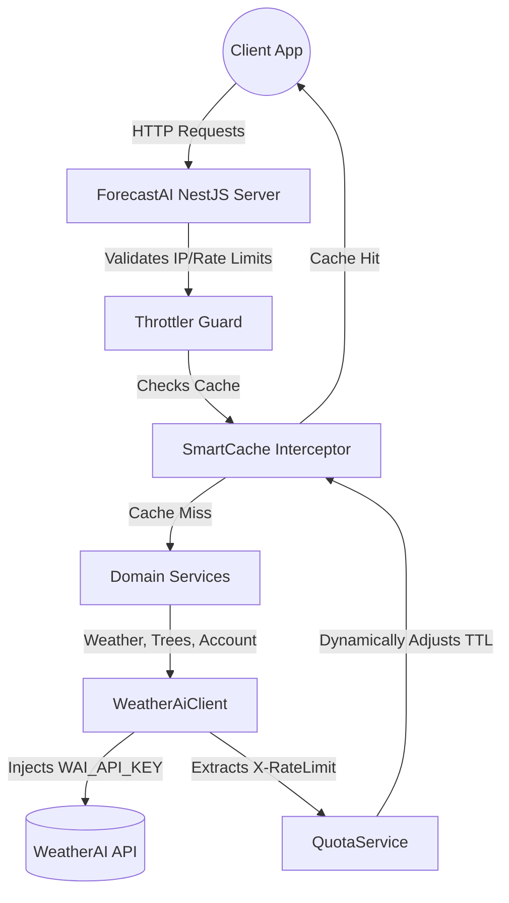

# ForecastAI Server

NestJS backend server that provides aggregated weather, geological data, and farm intelligence features to client applications by integrating with the [WeatherAI API](https://weather-ai.co/docs). It acts as a secure, standalone backend that maintains the WeatherAI API key server-side while extending functionality with custom dashboards, smart caching, rate-limiting, and multipart file handling.

## Architecture & Highlights (Evaluation Mapping)

This project was built to satisfy all core requirements of the WeatherAI backend assignment:

| Criterion | How this project delivers |
|---|---|
| **Core functionality** | Fully integrates the live WeatherAI API (`WAI_MOCK=false`). The custom `GET /v1/dashboard` route aggregates weather, geo, usage, and tree quotas into a single response, radically simplifying client integrations. |
| **Code quality & architecture** | Built on NestJS using strict Module boundaries, Dependency Injection, and typed DTOs with `class-validator`. Features a robust `SmartCacheInterceptor` that dynamically adjusts TTLs based on upstream quota constraints (`X-RateLimit-*`). |
| **Deployment & documentation** | Containerized with `Dockerfile` and `docker-compose.yml`. Includes a comprehensive `README`, an interactive Swagger UI (`/api`), Postman collections (`docs/`), and architectural diagrams (`docs/ARCHITECTURE.md`). |
| **Professional signal** | Clean Git history using Conventional Commits (`feat(module): ...`). Includes atomic commits that tell a clear implementation story from scaffold to deployment. |

## Features

- **Aggregated Dashboard**: Custom `/v1/dashboard` endpoint that concurrently aggregates weather, geological IP data, account usage, and farm intelligence quotas into a single unified payload.
- **Secure Integration**: Hides the upstream `WAI_API_KEY` from end users while providing seamless access to WeatherAI services.
- **Smart Adaptive Caching**: Dynamically reduces cache TTLs based on upstream rate limit quotas to preserve the API key's rate limits.
- **Farm Intelligence**: Proxies multipart/form-data for the Gemini-powered tree analysis endpoint.
- **Swagger Documentation**: Interactive OpenAPI documentation.


## Prerequisites

- Node.js 20+
- npm
- WeatherAI API key from [weather-ai.co](https://weather-ai.co) (optional if `WAI_MOCK=true`)
- Redis server (optional; defaults to in-memory cache if missing)


## Quick start

First, set up your environment variables:
```bash
cp .env.example .env
# Edit .env and set your WAI_API_KEY (or set WAI_MOCK=true for mock responses)
```

### Option A: Using Docker Compose (Recommended)
This is the easiest way to run the application, as it automatically provisions the Node server and a dedicated Redis instance linked together.

```bash
# Build and start the containers in detached mode
docker compose up -d --build

# View logs
docker compose logs -f
```
The server will be available at `http://localhost:3001`.

### Option B: Local Node.js (Requires Local Redis)
If you prefer running the application directly on your machine without Docker, ensure you have an instance of Redis running locally.

```bash
# Install dependencies
npm install

# Start local Redis (if you have redis-server installed)
redis-server &

# Run the app in development mode
npm run start:dev
```
The server will be available at `http://localhost:3001`.

Server listens on `http://localhost:3001` (or `PORT` from `.env`).

Explore the interactive API documentation at: **[http://localhost:3001/api](http://localhost:3001/api)**

## Available API Routes


| Route               | Method | Purpose                                    |
| ------------------- | ------ | ------------------------------------------ |
| `/v1/weather`       | `GET`  | Current conditions and forecast retrieval  |
| `/v1/weather-geo`   | `GET`  | Weather conditions with geological IP data |
| `/v1/dashboard`     | `GET`  | Aggregated weather, geo, usage, and quota  |
| `/v1/usage`         | `GET`  | Upstream API usage limits                  |
| `/v1/trees/analyze` | `POST` | AI farm analysis (multipart/form-data)     |
| `/v1/trees/history` | `GET`  | Paginated tree analysis history            |
| `/v1/trees/quota`   | `GET`  | Tree analysis quota remaining              |
| `/health`           | `GET`  | System health check                        |


## Environment variables


| Variable         | Required | Default                     | Description                                   |
| ---------------- | -------- | --------------------------- | --------------------------------------------- |
| `WAI_API_KEY`    | Yes*     | —                           | WeatherAI Bearer token (`wai_...`)            |
| `WAI_PLAN`       | No       | `free`                      | `free` | `pro` | `scale`                      |
| `WAI_MOCK`       | No       | `false`                     | Skip real upstream calls and return mock data |
| `WAI_BASE_URL`   | No       | `https://api.weather-ai.co` | Upstream API base URL                         |
| `REDIS_URL`      | No       | `redis://localhost:6379`    | Redis connection string                       |
| `PORT`           | No       | `3001`                      | HTTP port                                     |
| `NODE_ENV`       | No       | `development`               | `development` | `production` | `test`         |
| `THROTTLE_TTL`   | No       | `60000`                     | Rate-limit window (ms)                        |
| `THROTTLE_LIMIT` | No       | `60`                        | Max requests per window per IP                |


 *Not required when* `WAI_MOCK=true`*.*

## Architecture




## Scripts


| Command              | Description        |
| -------------------- | ------------------ |
| `npm run start:dev`  | Watch mode         |
| `npm run build`      | Compile to `dist/` |
| `npm run start:prod` | Run compiled app   |
| `npm run lint`       | ESLint             |


## License

Private — assignment project.