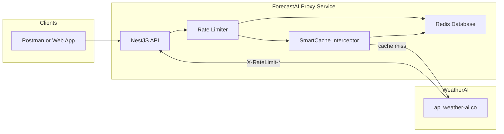

# ForecastAI Architecture

## System Context Diagram

## Module Responsibilities

1. **CommonModule**: Contains `WeatherAiClient` (abstracts HTTP calls to upstream, standardizes error handling), `QuotaGuard` (protects upstream limits), and `SmartCacheInterceptor` (dynamically alters caching duration based on limits).
2. **WeatherModule**: Exposes weather queries (`/v1/weather`, `/v1/weather-geo`). Integrates with cache intercepts.
3. **AccountModule**: Exposes usage data (`/v1/usage`).
4. **TreesModule**: Manages multipart file parsing, uploading, and analyzing. Includes endpoints for quota and history.
5. **DashboardModule**: An aggregate layer (`/v1/dashboard`) that fetches weather, geological data, trees quota, and account usage in parallel to reduce frontend round-trips.

## Request Lifecycle

1. **Client Request**: Hits a controller route.
2. **ThrottlerGuard**: Validates if the client IP has exceeded the 60req/min local limit. Drops request with `429 Too Many Requests` if exceeded.
3. **SmartCacheInterceptor**: Checks Redis for a cached response for the specific URL. If a valid cache exists, it is served immediately.
4. **QuotaGuard (optional per route)**: Validates if the upstream API token has exceeded its rate limits (based on tracked response headers).
5. **WeatherAiClient**: Fetches data from `api.weather-ai.co`, inserting the hidden API token. Normalizes any HTTP errors to abstract the backend. Parses quota headers (`X-RateLimit-*`) and updates `QuotaService`.
6. **Response**: Cached automatically for the designated TTL and returned to the client.

## Caching Strategy

Dynamic caching is implemented via the `SmartCacheInterceptor`. The TTL (Time-To-Live) automatically scales up when API limits run low.

| Resource | Base TTL | Description |
|---|---|---|
| Weather | 5 min | Cached by lat, lon, days, units, lang, ai |
| Account Usage | 5 min | Cached globally |
| Trees Quota | 10 min | Cached globally |
| Trees History | 2 min | Cached globally |

## Design Decisions

- **NestJS over Express**: Enforces strict module boundaries and provides decorators for dependency injection, interceptors, and Swagger integration out of the box.
- **Aggregate Pattern (`/v1/dashboard`)**: By fetching four disparate resources in parallel on the backend, we reduce network latency and client-side processing significantly.
- **Client Error Abstraction**: Upstream errors (like 404s or 422s from WeatherAI) are sanitized before being sent to the client. The client receives standard REST error codes, hiding the upstream implementation details.
