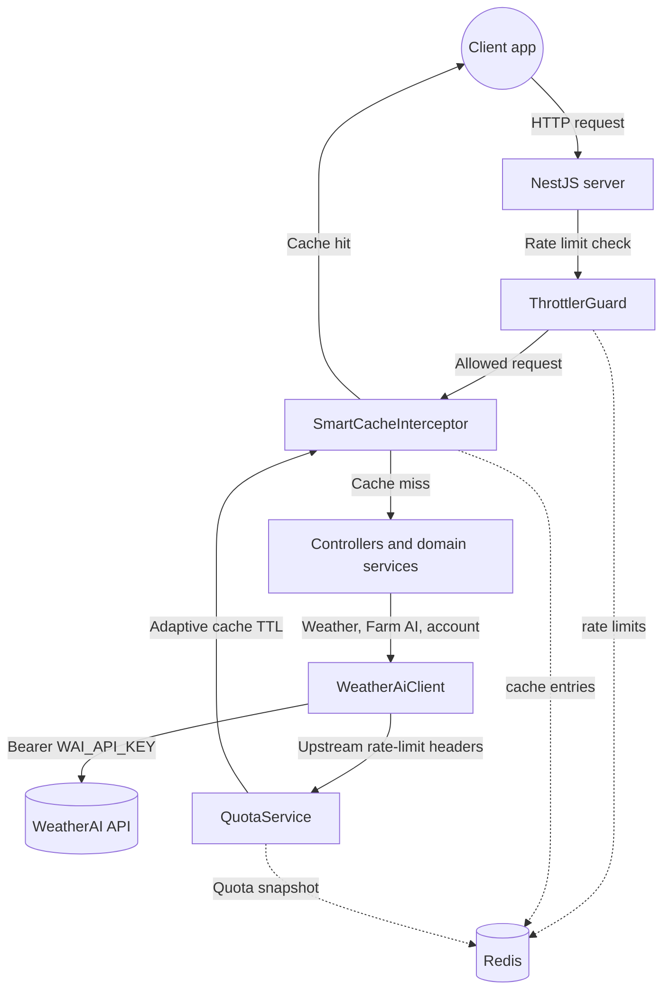

# ForecastAI backend architecture

ForecastAI is a NestJS proxy between the web client and WeatherAI. It keeps the upstream API key on the server, adds validation, rate limiting, Redis-backed caching, Farm AI image handling, and a small dashboard aggregate for the frontend.

The root [README](../../README.md) covers local development and deployment. This document is the canonical description of how the backend is organised and how requests move through it.

## System context

Redis backs the quota snapshot, cache entries, and rate-limit storage. The cache branch applies only to routes that use `SmartCacheInterceptor`; upload analysis requests are not cached. The request lifecycle below covers response caching and error handling in more detail.

## Request lifecycle

1. A request reaches a NestJS controller. Global validation transforms supported values and rejects unknown or invalid input.
2. The global `ThrottlerGuard` applies the per-IP rate limit, using Redis as its storage. Over-limit requests stop with `429`.
3. Cache-enabled routes run through `SmartCacheInterceptor`. A cache hit returns immediately; a cache miss or cache failure falls back to the route handler.
4. The controller delegates to a domain service. Weather, account, and Farm AI services use the shared `WeatherAiClient` for upstream calls.
5. `WeatherAiClient` attaches the server-only `WAI_API_KEY`, applies request timeouts, maps upstream failures to safe HTTP errors, and records upstream rate-limit headers when available.
6. The cache interceptor stores successful responses using the route's base TTL and the current quota snapshot. As upstream capacity gets low, it lengthens the TTL to reduce repeated upstream calls.
7. The global `HttpExceptionFilter` returns a consistent `{ "error": { "code", "message" } }` response for failures.

## Module responsibilities

| Module | Responsibility |
| --- | --- |
| `ConfigModule` | Loads and validates environment configuration. |
| `CommonModule` | Provides `WeatherAiClient`, `QuotaService`, and `SmartCacheInterceptor`. |
| `WeatherModule` | Serves coordinate-based, IP-geolocated, daily, hourly, and current weather routes. |
| `AccountModule` | Exposes upstream plan and usage information. |
| `TreesModule` | Validates farm-image uploads and provides Farm AI analysis, history, and quota routes. |
| `DashboardModule` | Aggregates IP-geolocated weather, usage, and Farm AI quota in parallel for the web dashboard. |
| `HealthModule` | Provides the `/health` service check. |

## Dashboard aggregation

`GET /v1/dashboard` calls the weather, account, and trees services concurrently with `Promise.allSettled`. This reduces client round trips while keeping the page usable when one upstream dependency fails: the failing section is returned as `{ "error": "…" }` and successfully resolved sections remain available.

## Caching and quota protection

Redis backs both the Nest cache manager and rate-limit storage. `WeatherAiClient` stores an upstream quota snapshot only when WeatherAI returns all required rate-limit headers. `SmartCacheInterceptor` uses that snapshot to select a multiplier for the endpoint TTL:

| Route group | Base TTL |
| --- | --- |
| Weather, IP-geolocated weather, daily, hourly, and usage | 5 minutes |
| Current conditions and dashboard | 2 minutes |
| Farm AI quota | 10 minutes |
| Farm AI history | 5 minutes (interceptor default) |

The adaptive thresholds and multipliers are configured with `ADAPTIVE_CACHE_*` variables. The interceptor is deliberately best-effort: if Redis or the quota lookup is unavailable, the request still proceeds instead of turning a cache problem into an API outage.

## Farm AI upload path

`POST /v1/trees/analyze` accepts `multipart/form-data`. Nest's file interceptor reads the `image` field, then a `ParseFilePipe` requires a JPEG or PNG no larger than 10 MB before passing the file and optional farm context to `TreesService`. The service forwards the image and metadata to WeatherAI through `WeatherAiClient`.

The response is passed through so the client can use its metrics, observations, recommendations, and the `original_image_url` and `overlay_image_url` supplied by the upstream analysis.

## Error handling

The backend does not expose upstream authentication details or raw provider error bodies. `WeatherAiClient` translates known upstream failures, and `HttpExceptionFilter` serialises all failures into the common error envelope documented in the [API reference](API.md). This keeps API clients independent of the provider's error format.

## Deployment shape

The root multi-stage `Dockerfile` builds the Vite frontend and the NestJS server. In the final image, `ServeStaticModule` serves the built frontend while excluding `/v1`, `/health`, and `/api` so API routes and Swagger remain handled by NestJS. Redis is an external service configured through `REDIS_URL`.
